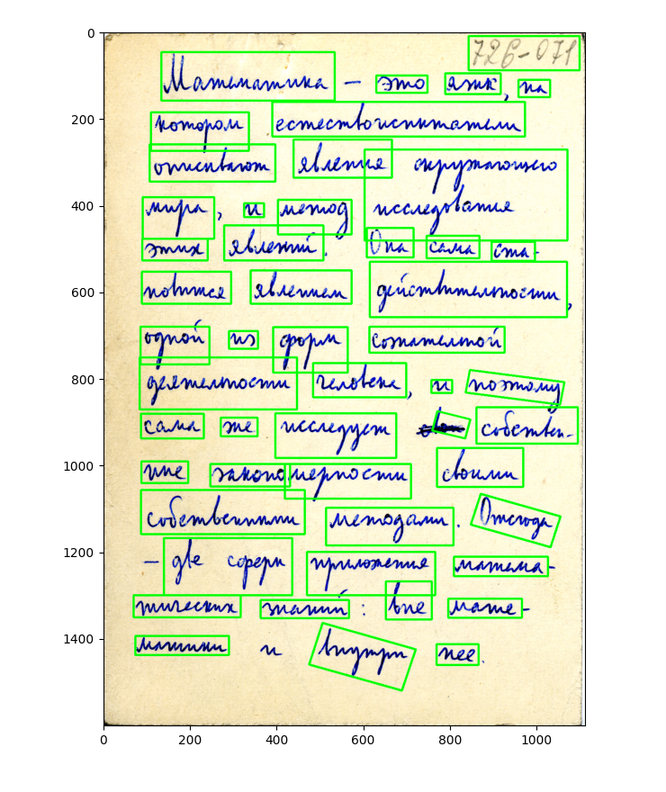

# CyrillicOCR-ResNet-Transformer

CyrillicOCR-ResNet-Transformer is an OCR machine learning project that employs a combination of EasyOCR, ResNet, and Transformer models to recognize and interpret Cyrillic handwriting. This project is designed to restore text from images, recognize OCR symbols, and also provide bounding boxes for the detected text regions.
<p align="center">
  
</p>

<p align="center">
  
</p>

<p align="center">
  
</p>

# Cyrillic Handwriting Dataset

- 72286 train images + labels
- 1544 test images + labels

<p align="center">
  
</p>

# Accuracy

The model's performance was evaluated based on word and character accuracy. The results are as follows:

- **Word Accuracy**: 0.8987726641209262
- **Character Accuracy**: 0.5382124352331606

## Workflow

1. **Text Detection (EasyOCR):** The first step involves detecting text in the input image. For this, we use EasyOCR, a ready-to-use OCR tool that supports over 80 languages, including Cyrillic scripts. EasyOCR is used to detect text regions in images and provide bounding boxes for the detected text.

2. **Feature Extraction (ResNet):** Once the text regions are identified, we use a ResNet (Residual Network) model to extract features from these regions. ResNet is a convolutional neural network that excels at learning from images. It captures the intricate patterns in the Cyrillic handwriting within the detected text boxes.

3. **Sequence Prediction (Transformer):** The extracted features are then fed into a Transformer model. The Transformer uses its self-attention mechanism to understand the context and sequence of the handwritten text. It predicts the sequence of characters, effectively translating the handwritten Cyrillic script into digital text.

4. **Evaluation Metrics (CER and WER):** The performance of CyrillicHandScriptDecoder` is evaluated using Character Error Rate (CER) and Word Error Rate (WER). These metrics provide a quantitative measure of the model's accuracy in recognizing individual characters and words, respectively.

By integrating these technologies within a Flask web application, `CyrillicHandScriptDecoder provides a user-friendly platform for Cyrillic handwriting recognition, contributing to the digitization and preservation of Cyrillic handwritten texts.

## Project Setup

This project uses several data files and a Python environment for its operation. Here's a brief description of the files we're downloading and how to set up the project:

### Data Files

1. `ocr_transformer_rn50_64x256_53str_jit.pt`: This is a pretrained model for the OCR transformer, which we use to recognize text within the detected regions.

2. `Cyrillic_Handwriting_Dataset.zip`: This is a dataset of Cyrillic handwriting, which we use for training and testing our models.

### Project Setup Script

We provide a setup script that creates a Python environment, downloads the necessary data files, and installs the required Python packages. You can run this script with the following command:

```bash
bash scripts/setup.sh
```

This command assumes that you're in the project root directory and that the `setup.sh` script is located in the `scripts/` directory. Please adjust the command if your directory structure is different.

### Python Environment

The setup script creates a conda environment with Python 3.9 and installs the required Python packages from the `requirements.txt` file. To activate this environment, use the following command:

```bash
conda activate ocr
```
## Inference

To use the inference script, run the following command:

```bash
python src/inference.py --config configs/config.json --weights ocr_transformer_rn50_64x256_53str_jit.pt --input_dir demo/input --output_dir demo/output --image_file demo/input/rukopi3.png --dump_bboxes True --dump_ocr True --dump_dir demo/dump
```

## Requirements and CUDA Version

This project requires several Python packages, Python 3.9, and a specific CUDA version. Here are the details:

### Python Packages

The project uses the following Python packages:

- `torch==1.7.1`
- `torchvision==0.8.2`
- `opencv-python`
- `scikit-image`
- `numpy`
- `scipy`
- `easyocr==1.7.1`
- `editdistance==0.6`
- `tqdm`
- `Augmentor`
- `matplotlib==3.8.4`
- `pandas`
- `keras_ocr`

You can install these packages using pip:

```bash
pip install -r requirements.txt
```

### CUDA Version

The project is developed with PyTorch which uses CUDA for GPU acceleration. The Docker image `pytorch/pytorch:1.7.1-cuda11.0-cudnn8-devel` is used, which comes with CUDA 11.0 and cuDNN 8 pre-installed.

### Using Docker

For ease of setup and ensuring a consistent environment, it is recommended to use Docker. The provided Dockerfile sets up an environment with all the necessary dependencies, Python 3.9, and the correct CUDA version. Instructions for building and running the Docker container are provided in the Docker Instructions section.

## Docker Instructions

1. **Build the Docker Image**

   You can build the Docker image using the following command:

   ```bash
   docker build -t cyrillicocr:latest .
   ```

   This command builds a Docker image from the Dockerfile in the current directory and tags it as `cyrillicocr:latest`.

2. **Run the Docker Container**

   After the image has been built, you can run the Docker container with the following command:

   ```bash
   docker run -p 80:80 cyrillicocr:latest
   ```

   This command runs the Docker container and maps port 80 in the container to port 80 on your host machine.
