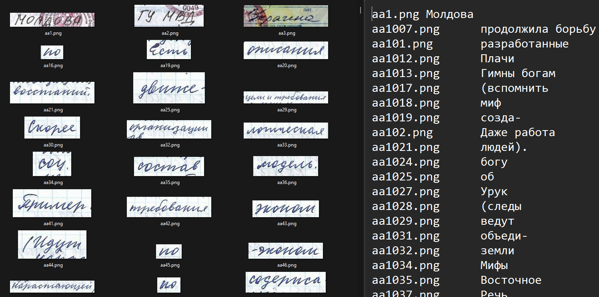

# Cyrillic Handwriting Dataset

- 72286 train images + labels
- 1544 test images + labels



## Overview
This repository contains the Cyrillic Handwriting Dataset for OCR tasks. The dataset is composed of 73,830 segments of handwritten texts (crops) in Russian and is split into train and test sets with a split of 95% and 5%, respectively. The dataset is provided by SHIFT Lab CFT.

## Description
The data was collected from open web sources and materials of members of the team. Each crop is an image of an expression in Russian of no more than 40 symbols written by hand.

## Data Directory Structure
The data is organized as follows:

data/
    test/
    test.tsv
    train/
    train.tsv

- `test/`: This directory contains the test set images.
- `test.tsv`: This file contains the labels for the test set.
- `train/`: This directory contains the train set images.
- `train.tsv`: This file contains the labels for the train set.


## Download and Extraction
To download and extract the dataset, you can use the following command:

```bash
gdown --id 1fOCrZsjiXtX8N_Yeb_PK6lcyDGcTJQoB -O Cyrillic_Handwriting_Dataset.zip
unzip Cyrillic_Handwriting_Dataset.zip -d utils/
rm Cyrillic_Handwriting_Dataset.zip
```

This will download the `Cyrillic_Handwriting_Dataset.zip` file and extract it to the `/data/` directory:
- test
- train
- test.tsv
- train.tsv

